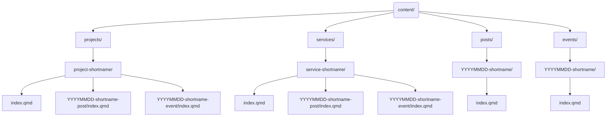

# dhbern.github.io

This repository contains the website of the Digital Humanities at the University of Bern. The data in this repository is openly available to everyone and is intended to support reproducible research.

[](https://github.com/DHBern/dhbern.github.io/issues) [](https://github.com/DHBern/dhbern.github.io/network) [](https://github.com/DHBern/dhbern.github.io/stargazers) [](https://github.com/DHBern/dhbern.github.io/blob/main/LICENSE-AGPL.md) [](https://github.com/DHBern/dhbern.github.io/blob/main/LICENSE-CCBY.md)

<!-- [](https://zenodo.org/badge/latestdoi/ZENODO_RECORD) -->

## Repository Structure

The structure of this repository follows the [Advanced Structure for Data Analysis](https://the-turing-way.netlify.app/project-design/project-repo/project-repo-advanced.html) of _The Turing Way_ and is organized as follows:

- `.github/` - GitHub configuration files (issue templates, workflows).
- `.husky/` - Husky configuration (pre-commit hooks).
- `.venv/` - Python virtual environment for website build.
- `assets/` - Images, stylesheets, JavaScript files.
- `docs/` - Documentation assets for README.md.
- `content/` - Website content (main and additional pages).
- `renv/` - R environment for website build.

## 📁 Content Structure and Categorization

The site is available under two main domains:

```mermaid
graph TD
  A[https://dhbern.github.io/] --> A1[News (Blog)]
  A --> A2[Events]
  A --> A3[Projects]
  A --> A4[Services]

  B[https://www.dh.unibe.ch/] --> B1[Studies]
  B --> B2[Team]
```

_Diagram: Overview of content domains for the public site and official university site._

- Content at **[https://dhbern.github.io/](https://dhbern.github.io/)** includes:

  - 📰 News and blog posts
  - 📅 Events
  - 🧪 Projects
  - 🛠 Services

- The official DH Bern university pages at **[https://www.dh.unibe.ch/](https://www.dh.unibe.ch/)** cover:

  - 📚 Study programs
  - 👥 Team information
    - ➤ Changes to the team page are made via [this Office form](https://forms.office.com/Pages/ResponsePage.aspx?id=ejgA1C8h6kOsf3eqEteXfhgnFcqTSVtNvO8z2rg4-SZUQlBGMUFZOFQyWElFWk5JRUpTWUdNSFY5Ty4u) (contact: Dominik Kilchberg).

### Folder Structure of Content



_Diagram: Folder layout for the `content/` directory, reflecting the site’s hierarchical structure._

- `content/projects/project-shortname/index.qmd`
  Projects live here and can contain nested posts or events.

- `content/services/service-shortname/index.qmd`
  Services must include `categories: [Services]` in the YAML header.

- `content/posts/YYYYMMDD-shortname/index.qmd`
  News/blog posts require `categories: [Post]`.

- `content/events/YYYYMMDD-shortname/index.qmd`
  Event entries require `categories: [Event]`.

### Categorization Logic

- 🏷 News posts: `categories: [Post]`
- 📆 Events: `categories: [Event]`
- 🛠 Services: `categories: [Services]`

All must be named `index.qmd` and reside in correctly named folders.

## 🚀 Getting Started

We recommend using **GitHub Codespaces** for a quick and reproducible setup.

### Quick Start with GitHub Codespaces

1. **Fork this repository** to your GitHub account (if needed).

   <div align="center">
     
   </div>

2. Click the green **`<> Code`** button at the top right of this repository.

3. Select the **“Codespaces”** tab and click **“Create codespace on `main`”**.
   GitHub will now build a container that includes:

   - ✅ Node.js (via `npm`)
   - ✅ Python with `uv`
   - ✅ R with `renv`
   - ✅ Quarto

   <div align="center">
     
   </div>

4. Once the Codespace is ready, open a terminal and preview the documentation:

   ```bash
   uv run quarto preview
   ```

   <div align="center">
     
   </div>

<details>
<summary>👩‍💻 Setup Locally (Advanced Users)</summary>

### Prerequisites

- [Node.js](https://nodejs.org/en/download/)
- [R](https://cran.r-project.org/) and Rtools (on Windows)
- [uv (Python manager)](https://github.com/astral-sh/uv#installation)
- [Quarto](https://quarto.org/docs/get-started/)

> _Note: `uv` installs and manages the correct Python version automatically._

### Setup Steps

```bash
# 1. Install Node.js dependencies
npm install

# 2. Setup Python environment
uv sync

# 3. Setup R environment
Rscript -e 'install.packages("renv"); renv::restore()'

# 4. Preview documentation
uv run quarto preview
```

</details>

## 🛠 Usage

Check file formatting:

```bash
npm run check
```

Format all files:

```bash
npm run format
```

Generate conventional commits:

```bash
npm run commit
```

Generate `CHANGELOG.md`:

```bash
npm run changelog
```

Preview the documentation:

```bash
uv run quarto preview
```

## 🧰 Support

This project is maintained by [@DHBern](https://github.com/DHBern). We encourage open support channels, so others can benefit.

| Type                            | Platforms                                                                    |
| ------------------------------- | ---------------------------------------------------------------------------- |
| 🚨 **Bug Reports**              | [GitHub Issues](https://github.com/DHBern/dhbern.github.io/issues)           |
| 📊 **Report Bad Data**          | [GitHub Issues](https://github.com/DHBern/dhbern.github.io/issues)           |
| 📚 **Docs Issues**              | [GitHub Issues](https://github.com/DHBern/dhbern.github.io/issues)           |
| 🎁 **Feature Requests**         | [GitHub Issues](https://github.com/DHBern/dhbern.github.io/issues)           |
| 🛡 **Security Vulnerabilities** | See [SECURITY.md](SECURITY.md)                                               |
| 💬 **General Questions**        | [GitHub Discussions](https://github.com/DHBern/dhbern.github.io/discussions) |

## 🗺 Roadmap

TBA

## 🤝 Contributing

Contributions are welcome! Report problems, propose changes, or submit new features via issues or pull requests. See [CONTRIBUTING.md](CONTRIBUTING.md) for details.

## 🧾 Versioning

We use [SemVer](http://semver.org/). See [tags](https://github.com/DHBern/dhbern.github.io/tags) for available versions.

## ✍️ Authors and Acknowledgment

- **Moritz Mähr** – _Initial work_ – [@maehr](https://github.com/maehr)

See also the list of [contributors](https://github.com/DHBern/dhbern.github.io/graphs/contributors).

## 🪪 License

- **Data**: Creative Commons Attribution 4.0 International (CC BY 4.0) – see [LICENSE-CCBY](LICENSE-CCBY.md).
- **Code**: GNU Affero General Public License v3.0 – see [LICENSE-AGPL](LICENSE-AGPL.md).
