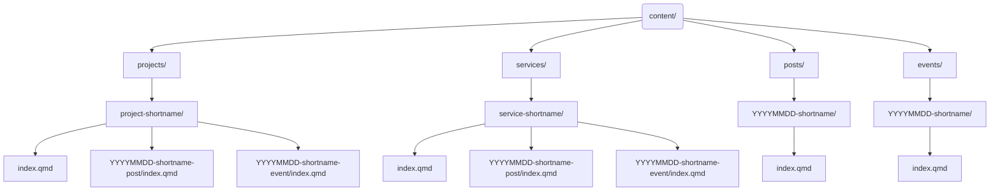

# dhbern.github.io

This repository contains the website of the Digital Humanities at the University of Bern. The data in this repository is openly available to everyone and is intended to support reproducible research.

[](https://github.com/DHBern/dhbern.github.io/issues) [](https://github.com/DHBern/dhbern.github.io/network) [](https://github.com/DHBern/dhbern.github.io/stargazers) [](https://github.com/DHBern/dhbern.github.io/blob/main/LICENSE-AGPL.md) [](https://github.com/DHBern/dhbern.github.io/blob/main/LICENSE-CCBY.md)

<!-- [](https://zenodo.org/badge/latestdoi/ZENODO_RECORD) -->

## Repository Structure

The structure of this repository follows the [Advanced Structure for Data Analysis](https://the-turing-way.netlify.app/project-design/project-repo/project-repo-advanced.html) of _The Turing Way_ and is organized as follows:

- `.github/` - Contains the GitHub configuration files, including the issue templates and workflows.
- `.husky/` - Contains the Husky configuration files, including the pre-commit hooks and the Husky settings.
- `.venv/` - Contains the Python virtual environment used to build the website, including the Python packages and their versions.
- `assets/` - Contains all the assets used in the website, including images, stylesheets, and JavaScript files.
- `content/` - Contains the content of the website, including the main page and any additional pages.
- `renv/` - Contains the R environment used to build the website, including the R packages and their versions.

## 📁 Content Structure and Categorization

The website is maintained under two main domains:

```mermaid
graph TD
  A[https://dhbern.github.io/] --> A1[News (Blog)]
  A --> A2[Events]
  A --> A3[Projects]
  A --> A4[Services]

  B[https://www.dh.unibe.ch/] --> B1[Studies]
  B --> B2[Team]
```

- Content published at **[https://dhbern.github.io/](https://dhbern.github.io/)** includes:

  - 📰 News and blog posts
  - 📅 Events
  - 🧪 Projects
  - 🛠 Services

- The official DH Bern university pages at **[https://www.dh.unibe.ch/](https://www.dh.unibe.ch/)** cover:

  - 📚 Study programs
  - 👥 Team information

### Folder structure of content



- `content/projects/project-shortname/index.qmd`
  Each project resides in its own folder and can include blog posts or event entries.

- `content/services/service-shortname/index.qmd`
  Services are structured similarly but **must include** a YAML header with `categories: [services]`.

- `content/posts/YYYYMMDD-shortname/index.qmd`
  News/blog posts live here or may be embedded under a project folder. Each must include `categories: [Post]`.

- `content/events/YYYYMMDD-shortname/index.qmd`
  Events may also be project-specific or standalone and must include `categories: [Event]`.

### Categorization logic

- 🏷 News are markdown files with a YAML header containing `categories: [Post]`.
- 📆 Events require `categories: [Event]`.
- 🛠 Services require `categories: [services]`.

All such files must be named `index.qmd` inside appropriately named folders.

## Getting Started

We recommend using **GitHub Codespaces** for the easiest and fastest setup. It gives you a pre-configured, cloud-based development environment with everything ready to go — directly in your browser.

### 🚀 Quick Start with GitHub Codespaces

1. **Fork this repository** to your GitHub account (if needed).

<div align="center">
  
</div>

2. Click the green **`<> Code`** button at the top right of this repository.

3. Select the **“Codespaces”** tab and click **“Create codespace on `main`”**.

<div align="center">
  
</div>

4. GitHub will now build a container that includes:

   - ✅ Node.js (via `npm`)
   - ✅ Python with `uv`
   - ✅ R with `renv`
   - ✅ Quarto

5. Once the Codespace is ready, you can preview the documentation locally inside the Codespace with:

   - **Open a terminal** in the Codespace (Terminal > New Terminal).
   - **Run the following command** to install all dependencies:

```bash
uv run quarto preview
```

<div align="center">
  
</div>

<details>
<summary>👩‍💻 Setup locally (Advanced users)</summary>

### Prerequisites

Make sure the following tools are installed locally:

- [Node.js](https://nodejs.org/en/download/)
- [R](https://cran.r-project.org/) and Rtools (on Windows)
- [uv (Python manager)](https://github.com/astral-sh/uv#installation)
- [Quarto](https://quarto.org/docs/get-started/)

> _Note: `uv` automatically manages a Python version if none is installed._

### Local setup steps

```bash
# 1. Install Node.js dependencies
npm install

# 2. Setup Python environment
uv sync

# 3. Setup R environment
Rscript -e 'install.packages("renv"); renv::restore()'

# 4. Preview documentation
uv run quarto preview
```

</details>

## Use

Check that all files are properly formatted.

```bash
npm run check
```

Format all files.

```bash
npm run format
```

Run the wizard to write meaningful commit messages.

```bash
npm run commit
```

Run the wizard to create a CHANGELOG.md.

```bash
npm run changelog
```

Preview the documentation.

```bash
uv run quarto preview
```

## Support

This project is maintained by [\@DHBern](https://github.com/DHBern). Please understand that we can't provide individual support via email. We also believe that help is much more valuable when it's shared publicly, so more people can benefit from it.

| Type                                   | Platforms                                                                    |
| -------------------------------------- | ---------------------------------------------------------------------------- |
| 🚨 **Bug Reports**                     | [GitHub Issue Tracker](https://github.com/DHBern/dhbern.github.io/issues)    |
| 📊 **Report bad data**                 | [GitHub Issue Tracker](https://github.com/DHBern/dhbern.github.io/issues)    |
| 📚 **Docs Issue**                      | [GitHub Issue Tracker](https://github.com/DHBern/dhbern.github.io/issues)    |
| 🎁 **Feature Requests**                | [GitHub Issue Tracker](https://github.com/DHBern/dhbern.github.io/issues)    |
| 🛡 **Report a security vulnerability** | See [SECURITY.md](SECURITY.md)                                               |
| 💬 **General Questions**               | [GitHub Discussions](https://github.com/DHBern/dhbern.github.io/discussions) |

## Roadmap

TBA

## Contributing

All contributions to this repository are welcome! If you find errors or problems with the data, or if you want to add new data or features, please open an issue or pull request. Please read [CONTRIBUTING.md](CONTRIBUTING.md) for details on our code of conduct and the process for submitting pull requests.

## Versioning

We use [SemVer](http://semver.org/) for versioning. The available versions are listed in the [tags on this repository](https://github.com/DHBern/dhbern.github.io/tags).

## Authors and acknowledgment

- **Moritz Mähr** - _Initial work_ - [maehr](https://github.com/maehr)

See also the list of [contributors](https://github.com/DHBern/dhbern.github.io/graphs/contributors) who contributed to this project.

## License

The data in this repository is released under the Creative Commons Attribution 4.0 International (CC BY 4.0) License - see the [LICENSE-CCBY](LICENSE-CCBY.md) file for details. By using this data, you agree to give appropriate credit to the original author(s) and to indicate if any modifications have been made.

The code in this repository is released under the GNU Affero General Public License v3.0 - see the [LICENSE-AGPL](LICENSE-AGPL.md) file for details. By using this code, you agree to make any modifications available under the same license.
